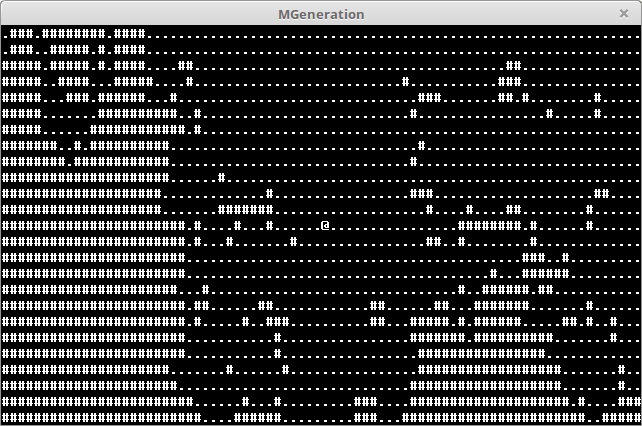

# ASCII Open World RPG

## What is It?

This is an open world (™) rogulike RPG game I wrote in one evening.



The only thing you need to do is to explore the vast and (which is more important!)
empty world. This means the game is as good as any modern open world (™) RPG.

Enjoy!

## How to Build

Make sure a C compiler is installed on your system (gcc or clang). Clone or download
the repository and run ```cmake CMakeLists.txt``` and later ```make```. The output
will be the `MGeneration` binary - run it to start the game. Linux and macOS are supported.
Not sure about Windows but Windows users have enough open world (™) RPGs anyway.

## Own Maps

If you run `MGeneration` without options a new map will be generated each time you
run the game. Another option is to run `MGeneration [File]` and point it to
your own world map file (an example map is included).

## Controls

Use the arrow keys to navigate.

## License

This program is free software: you can redistribute it and/or modify
it under the terms of the GNU General Public License as published by
the Free Software Foundation, either version 3 of the License, or
(at your option) any later version.

[WTFPL](License.md)